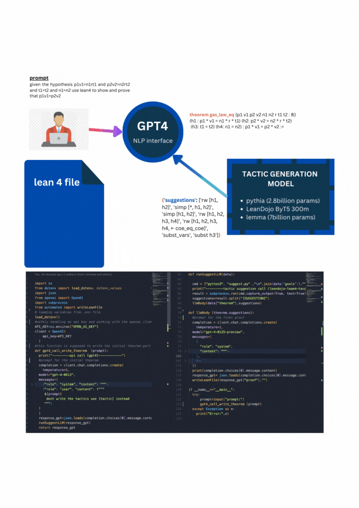

# LLMS FOR AUTOMATED THEOREM  PROVING (LEAN4)
## Background
This project explores the use of Large Language Models (LLMs) for theorem proving in Lean4, a theorem prover and programming language for formalizing mathematics and computer science concepts. The main goal is to utilize the capabilities of LLMs to assist in the process of writing proofs, making it more efficient and accessible.

## COMBINATIONAL MODEL ARCHITECTURE WORKFLOW
The project uses a combinational model architecture that bridges the strengths of different LLM abilities. Encoder-decoder models like LeanDojo ByT5 and Pythia are optimized for generating and working with Lean tactic syntax, structure, and patterns, making them proficient in tactic suggestion. decoder-only models like GPT-4 are trained text data, making them more versatile in processing and generating natural language .

By using the domain-specific abilities of encoder-decoder models and the natural language processing (NLP) interfacing capabilities of GPT-4, i aimed to create a workflow that capitalizes on the strengths of both model architectures, resulting in better and more scalable performance.
## Project setup
it is reccomended to have Lean 4 on your computer 
# Create a virtual environment
```bash
python -m venv env
```
```bash
source env/bin/activate  # Linux/Mac
```
```bash
env\Scripts\activate  # Windows
```

# install  the Python requirements
```bash
pip install -r requirements.txt
```
# add lake-packages

```bash 
lake build 
```

## Servers
The `llms` tactic communicates with a server that you can run in your own environment (e.g., CPU, GPU, Google Colab).

The table below shows the recommended language model and server scripts.
To start a server, use `python {script}`, e.g. `python python/server_encdec.py`:

| Environment  | Script | Default Model | Context |Speed | miniF2F-test |
| -------- | ------- | ------- |-------|------- |------- |
| CPU  | `python/server_encdec.py` | [LeanDojo ByT5 300m](https://huggingface.co/kaiyuy/leandojo-lean4-tacgen-byt5-small) | State | 3.16s | 22.1\%|
| CUDA GPU | `python/server_vllm.py` | [Pythia 2.8b](https://huggingface.co/wellecks/llmstep-mathlib4-pythia2.8b) |State|**0.25s** | **27.9\%**|

## using the workflow 
- create a ` .env ` file in the root of the project and add 
```bash
OPEN_AI_KEY="*********************"
```
- put in your openai api key 
- in another terminal  run the `lemma.py` file  and write ur prompt in in the terminal
N.B make sure the server is running 
the 

#### Citation
The repository and workflow architecture  was greatly  inspired by
 [llemma_formal2formal](https://github.com/wellecks/llemma_formal2formal). 